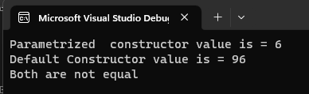

# Operator-Overloading

## Aim:
 To write a C# program to pass values through constructors(default and parameterized) and also overload equal operators by checking whether objects are equal using operator overloading. 
 
 ## Algorithm:
### Step 1:
Create a class operator

### Step 2:
Pass values through the constructor

### Step 3:
Return the bool operator, (==) and (!=)

### Step 4:
Create a object to store the return object

### Step 5:
Print the program.
 
 
 ## Program:
 ~~~
 NAME : P.SANDEEP
 REG_NO : 212221230074
 ~~~
 ~~~
using System;
namespace overload
{
    class program
    {
        int n;
        public program()
        {
            this.n = 96;
            Console.WriteLine("Default Constructor value is = " + this.n);
        }

        public program(int a)
        {
            this.n = a;
            Console.WriteLine("Parametrized  constructor value is = " + this.n);
        }
        public static bool operator ==(program a, program b)
        {
            return a.Equals(b);
        }
        public static bool operator !=(program a, program b)
        {
            return !a.Equals(b); 
        }
        static void Main(string[] args)
        {
            program a = new program(6);
            program e4 = new program();
            program e2 = e4;
            if (e2 == a)
            {
                Console.WriteLine("Both are equal");
            }
            else
            {
                Console.WriteLine("Both are not equal");
            }
        }
    }
}
 ~~~
 
 
 ## Output:
 
 
 
 ## Result:
Thus the C# program to find the volume of a box using operator overloading is implemented successfully.

